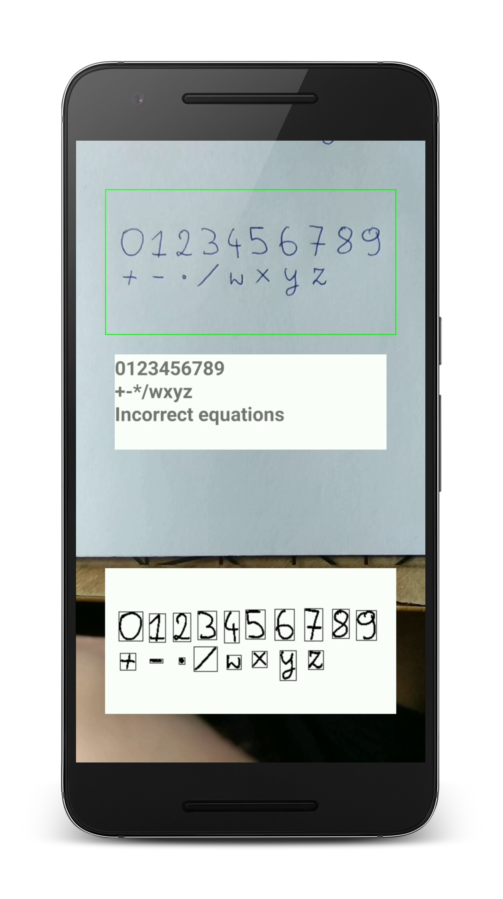
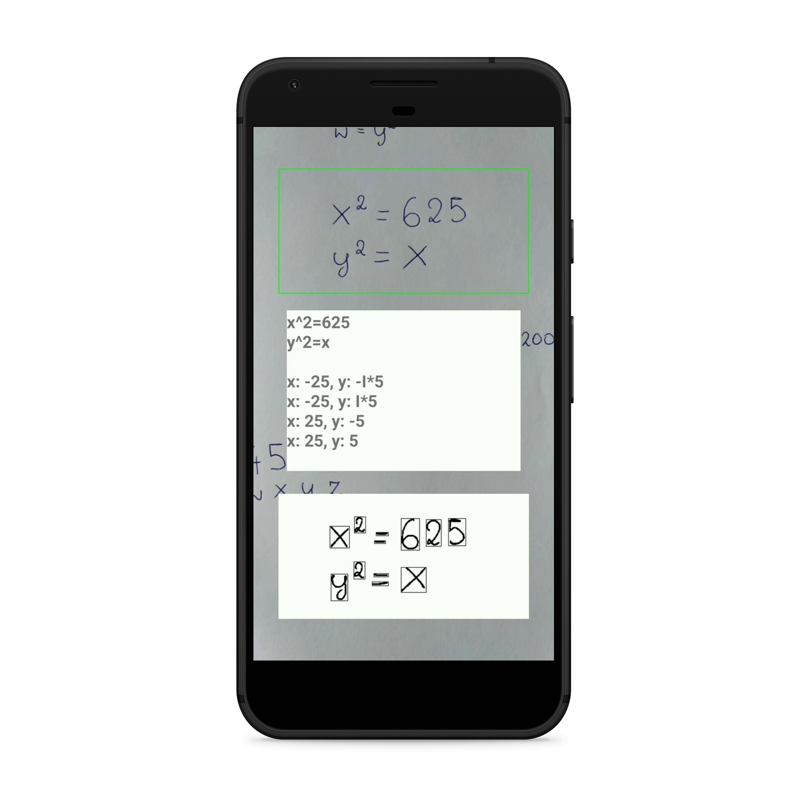

# Camculator
Android app capable of recognizing and solving math equations based on the camera input. It supports systems of equations with the following properties:
* only containing integers,
* having only the following operators: `+`, `-`, `/`, `*` and `^` (exponentiation)
* the variables are marked as one of the following: `x`, `y`, `z` or `w`

  
   

